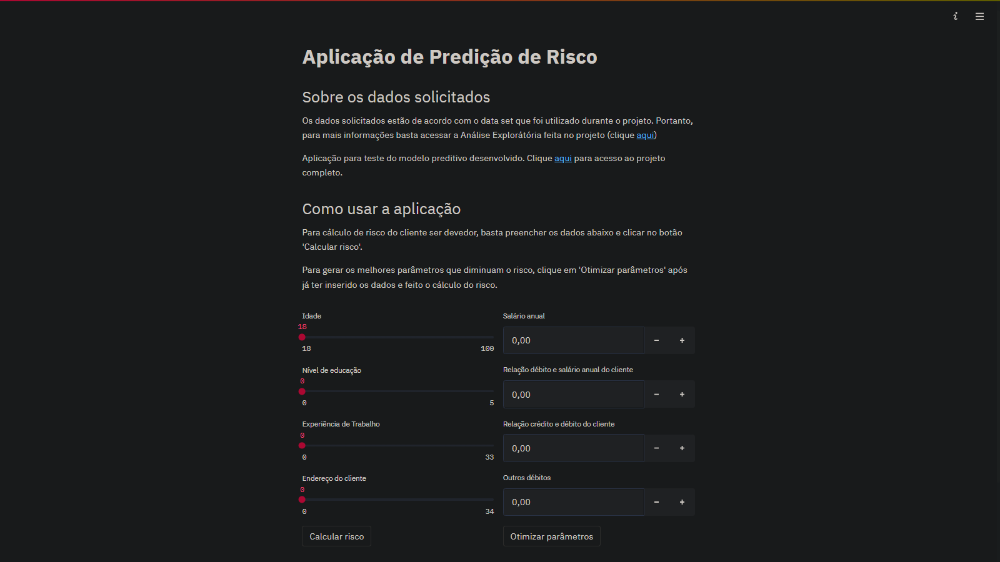

# Projeto de Data Science - Predição de risco de crédito 

## Objetivo
O objetivo deste projeto é de desenvolver um meio de reduzir o número de dívidas não pagas, que geram prejuízo à empresas de crédito:

- Construir uma maneira de **classificar se existe risco ou não para cada cliente** com base em suas características, sendo que o risco se dá pela classificação do indivíduo em dois grupos: devedores e não devedores. 

- Desenvolver algum meio de reduzir a chance de risco para cada cliente, com intuito de evitar o prejuízo com dívidas não pagas. 

## Resultado
Foi criada uma aplicação capaz de, ao receber certos dados de determinado indivíduo, **gerar uma probabilidade do mesmo ser um cliente devedor**. Ademais, foi também implementada nessa tal aplicação a função de **otimização de parâmetros**, a qual fornece possíveis valores para alguns parâmetros que irão resultar em uma menor chance do cliente ser um devedor.

Portanto, a aplicação feita **estima a chance (probabilidade) de determinado cliente ser devedor** e também fornece sugestões de valores que, ao serem atribuídos para o indivíduo, podem **diminuir sua respectiva probabilidade de ser devedor**.

## Desenvolvimento do projeto
Abaixo, tem-se um resumo de cada pasta do projeto e seu conteúdo:

### 1. Dados
Pasta que contém o data set. Os dados dados foram obtidos no site do kaggle e podem ser acessados clicando [aqui](https://www.kaggle.com/datasets/atulmittal199174/credit-risk-analysis-for-extending-bank-loans). Abaixo, é possível ter acessa ao que cada coluna traz de informação:

Coluna | Conteúdo
----|----
age | Idade dos clientes
ed | Nível de educação dos clientes
employ | Experiência de emprego do cliente
address | Endereço do cliente
income | Salário anual do cliente
debtinc | Relação débito e salário do cliente 
creddebt | Relação crédito e débito do cliente
othdebt | Outros débitos
default | Cliente não pagou suas dívidas anteriormente

### 2. Notebooks
Pasta que contém os notebooks desenvolvidos

#### 2.1 AED - Análise exploratória de dados
Neste documento, foi feita a análise exploratória do data set disponível em *bankloans.csv*, cuja estrutura foi abordada introdutoriamente no tópico anterior. Diversas informações, técnicas e gerais, foram extraídas e resumidas neste notebook, como também algumas imagens referentes à elas (imagens de gráficos e tabelas - armazenadas na pasta 'Imagens').  

#### 2.2 Modeling
Este arquivo contém todo o pré processamento (tratamento) dos dados, assim como seu processamento e modelagem de alguns dos principais algoritmos de Machine Learning para classificação de dados. Ao final, foi feita também a avaliação de cada modelo utilizando de métricas como: precisão, recall, f1 score e matriz de confusão (visualizadas graficamente) e o melhor modelo foi salvo para uso na aplicação.

### 3. Imagens
Pasta que contém as imagens salvas resultantes da AED, imagens referentes ao app e algumas outras imagens utilizadas no projeto.

### 4. Modelos
Pasta que contém os modelos preditivos desenvolvidos nos notebooks. Nessa primeira versão do projeto, apenas um modelo foi desenvolvido, cuja finalidade é classificar clientes em devedores e não devedores.

### 5. Aplicação
Pasta que contém os arquivos referentes a aplicação do modelo. Vale ressaltar que o app é executado com o streamlit de forma local.

## Sobre o autor do projeto
Me chamo Vinícius de Paula Pilan, sou estudante de Ciência da Computação na Universidade Estadual Paulista - Júlio de Mesquita Filho - UNESP e tenho muito interesse em me profissionalizar na área de Ciência de Dados. Atualmente, busco aprender cada vez mais sobre o assunto e esse projeto foi um meio de adquirir ainda mais conhecimento nessa área.

Agradeço pelo seu interesse nesse trabalho!

**Formas de contato:**
- **Email:** vinicius.pilan@unesp.br
- **LinkedIn:** Vinícius de Paula Pilan
- **GitHub:** ViniPilan
